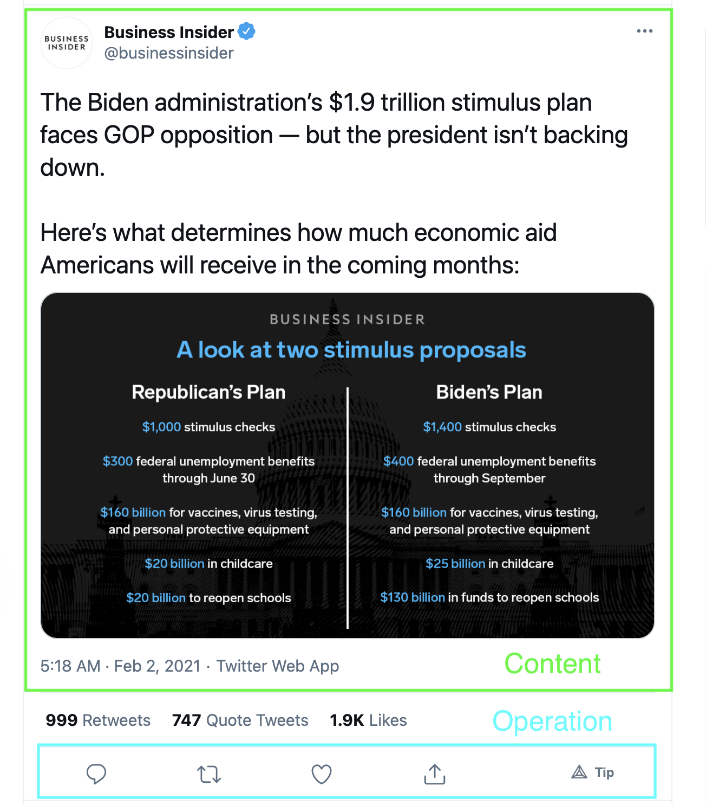

# A idea about decentralized social meadia Protocol

I like the social media, it helps me making friends and getting knowledge. However, the social media also has their problems like violating users' privacy and censorship and I think IPFS is a good solution. We already saw a lot of social media platform bases on IPFS and they are all pretty cool, but should we create a new platform? Or we should can a new protocol.

Before we begin to try to create this protocol, we should take look the existed social platform again and figure out What are key elements of those websites. In my opinion, these websites are made with `Post` and each `Post` has `Content` and `Operation`.  It looks abstract, So let's see some examples.




In Twitter example, the `Content` is text and pictures and the `Operation` is comments, retwitt and like (We ignore the share, because it's local operation). Of course, this model is not perfect suiting any social media platform, but it's good enough for me.

If you are familiar with ADT(Abstract Data Type), It's pretty like it. The `Post` is `Type`, `Content` is `Value` and `Operation` is just `Operation`.

Now, We have this Model and new question is how to give the feedback to Poster? That's actually simple, we just need give a pubsub channel to each Post (Of course, we can share a same channel for multi-post) as the way to feedback.

There is IPLD schema. (I'm new to it, so If I'm wrong, please correct me.)

```ipldsch
type Post struct {
    version Version
    update RFC3339
    channel nullable string
    history [&Content] #Includes first.
    content &Content
    operations [Operation]
}
```

the `history` in there is for supporting the mutable post.

When we have the `Post`, We can create the `List` to contain these `Posts`. Like this.

```ipldsch
type List struct {
    version Version
    subLists nullable [&List]
    posts nullable [&Post]
}
```

The List should also have `subLists`, it will help to gather information.

When we have the `Post` and `List` We can desgin a new `Content` and `Operation`. For the sake of simplicity, we will create a image based `Content` (like Instergram).

```lpldsch
type Content enum {
    ｜ ImageContent
}
type ImageContent struct {
    version Version
    fileType string
    image Link
}
```

`fileType` represents image type like `png` and `image` represents the CID of a image. Then, we can create a new `Operation`, this `Operation` call `like`

```ipldsch
type Operation enum {
    | LikeOperation
}
type LikeOperation struct {
    version Version
    value int
    feedback LikeFeedBack
}
type LikeFeedBack struct {
    like GenericLikeFeedBack
    revokeLike GenericLikeFeedBack
}
type GenericLikeFeedBack struct {
    type LikeFeedBackType
    content &Content
}
type LikeFeedBackType enum{
    | Like
    | RevokeLike
}
```

Every Operation should have `value` and `feedback` fields. The `vaule` fields is providing the state of this operation, in our case, it's number of like. The `feedback` field tells viewers how to feedback to poster. It's should be a struct, because there may be some sub-operations like `Like` and `RevokeLike`.

When viewer see the `feedback`, they can follow  these information and feedback to poster.

The Whole protocol looks like this.


